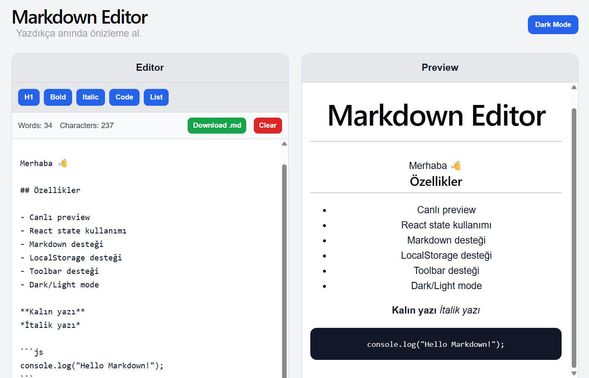

# Markdown Editor

A modern and responsive Markdown editor built with React.  
Write Markdown on the left, see the live preview on the right — instantly.

## Live Features

-  Live Markdown preview
-  Dark / Light mode toggle
-  Toolbar (add Markdown with buttons)
-  Word & character counter
-  Clear editor
-  Download as `.md` file
-  LocalStorage persistence (auto-save)
-  Fully responsive design

## Tech Stack

- React (Hooks)
- Vite
- JavaScript (ES6+)
- CSS
- react-markdown

## Screenshots


## Installation

```bash
git clone https://github.com/Aley777/MarkdownEditor.git
cd markdown-editor
npm install
npm run dev
```

## What I Learned

- Managing state with React Hooks (`useState`, `useEffect`)
- Building controlled components (textarea)
- Live preview rendering
- Working with third-party libraries (`react-markdown`)
- Using LocalStorage for persistence
- Implementing theme switching
- Handling file downloads in browser
- Responsive layout with CSS Grid

## Project Structure

```
src/
 ├── App.jsx
 ├── App.css
 └── main.jsx
```

## Why This Project?

This project demonstrates core frontend skills:

- Real-time UI updates
- State management
- Clean component structure
- User experience improvements
- Practical feature implementation

## License

This project is open source and available under the MIT License.